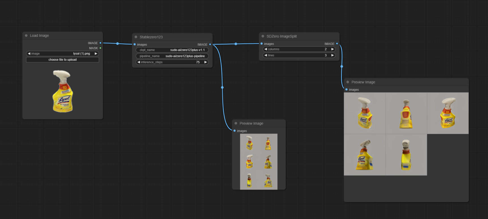
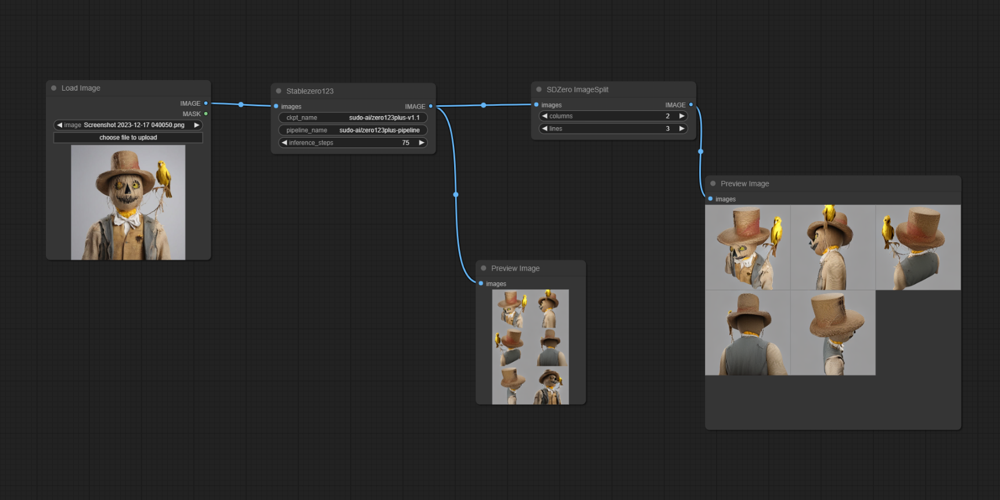

# ComfyUI StableZero123 Custom Node

## Introduction
StableZero123 is a node wrapper that uses the model and technique provided here:
- https://github.com/SUDO-AI-3D/zero123plus/

It uses the Zero123plus model to generate 3D views using just one image.

If anyone have some ideas about how to do it, again, thank you very much for yor collaboration and tips.

## Installing
To install this node, is just like any other one, no special procedures are needed:
    - Git clone the repository in the ComfyUI/custom_nodes folder
    - Restart ComfyUI

## How to use
Here you can see an example of how to use the node

And here other even more impressive:

Notice that the input image should be a square.

## Next Steps
To develop a new node that also uses ControlNet to add depth information and make better images.

## Under development
This node is under development, so use it at your own risk. And probably the interface will change a lot, impacting the generated workflows in the future versions.

